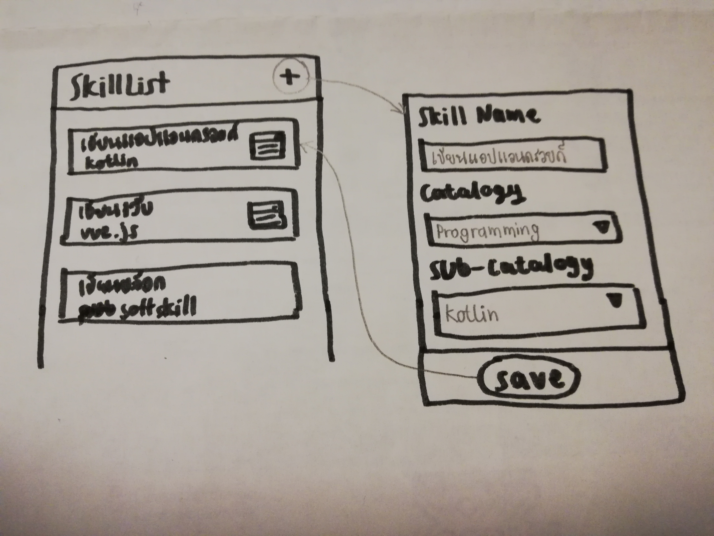

# SkillList
This is assignment for intern of Android Developer

สวัสดีน้องๆว่าที่นักศึกษาตำแหน่ง Android Developer ทุกคนจ้าาาาาา
โจทย์แบบฝึกหัด คือ สร้างแอปแสดง skill list ของผู้ใช้งาน โดยจะต้องทำหน้า UI จำนวน 2 หน้า ดังนี้

1. หน้าแรก แสดง skill ทั้งหมดของ user บน Navigation Bar ด้านบนมีปุ่มเพิ่ม skill
- ในส่วนของ item จะแสดงข้อมูล และมี icon ของ catalog อยู่ด้านขวามือ

2. หน้าเพิ่ม skill โดยหลังจากเพิ่มแล้ว จะต้องถูกเพิ่มที่ตำแหน่งบนสุดของหน้าแรก
- ในส่วนของ catalog และ sub-catalog จะแสดงเป็น BottomSheet
โดยข้อมูลในส่วน sub-catalog จะสามารถเลือกได้เมื่อเลือก catalog แล้วเท่านั้น

#### ข้อบังคับ
- เขียนแอปด้วยภาษา Kotlin เท่านั้น
- มี Unit Test อย่างน้อย 1 ไฟล์
- ทำ README.md เพื่อเล่ารายละเอียดการทำงาน และหน้าจอของแอพพลิเคชั่น โดยต้องเขียนไฟล์นี้ขึ้นมาใหม่ทั้งหมด

#### เพิ่มเติม
- icon ต่างๆสามารถใช้จาก https://material.io/tools/icons/?style=baseline
- สามารถ mock-up ข้อมูลขึ้นมาได้สำหรับ catalog และ sub-catalogcatalog

วิธีการส่งงาน ให้ fork repo นี้แล้วส่ง issue ขึ้นมา โดยพิจารณาร่วมกันกับใบสมัคร
